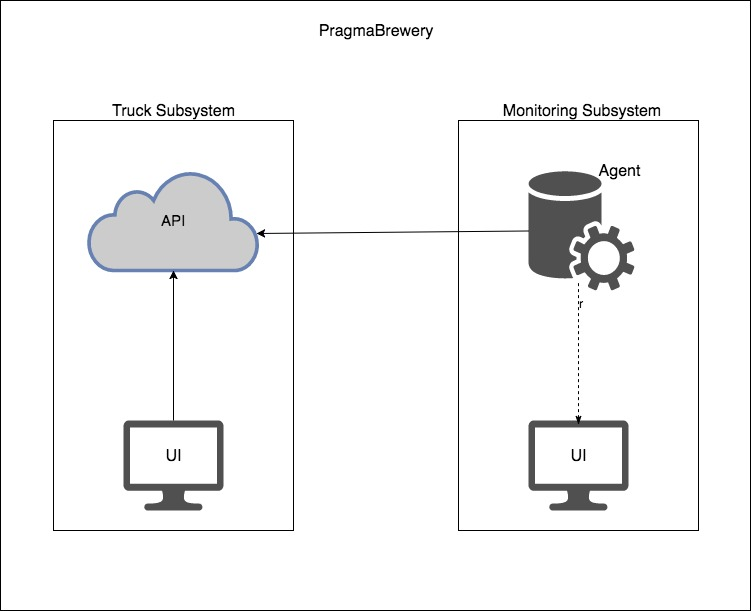

# PragmaBrewery

Pragama Brewry is a system to monitor the temperature of containers inside a refrigerated truck. The system is divided in two subsystems: the truck subsytem and the monitoring subsystem. Each subsystem is divided in two microservice in a total of four microservices:

  - truck-ui
  - truck-api
  - monitoring-agent
  - monitoring-ui

### Architecture



The architecture is based in other monitoring systems (e.g. Prometheus), where an agent scraps a  service's metrics a and push the information to clients connected to it.

##### Monitoring agent

The monitoring agent is responsible for access a configured endpoint of a target service, collecting the information and pushing them to the clients connected. The agent access the endpoint via a http GET and push to the connected clients via WebSocket.

##### Monitoring UI

The monitoring UI is a microservice responsible for displaying the information about the containers to the driver. This microservice is basically a client side application developed with [BackboneJS](http://backbonejs.org/) in a reactive achitecture, where it will connect to the monitoring agent via WebSocket and display the information in real time.

##### Truck API

This microservice is an API responsible for simulating the refrigerated truck. Basically, it has an API to manipulate (create/remove/update) containers.

##### Truck UI

The truck UI is a microservice responsible for communicating with the truck API and simulating a real world situation, where the driver can add, remove and open the door of a container.

### Running the application

To run the application you will need to have [Docker](https://www.docker.com/) and [Docker Compose](https://docs.docker.com/compose/) installed in your machine.

```sh
$ cd pragma-brewery
$ ./run.sh
```

> **Note:** The compose file is configured to use the ports 3000, 3001, 3002, 3003. Make sure you have them enabled in your Docker Machine to access them using localhost. 
You can also change the compose file, but make sure you change the enviroment variables of each service to make them reachable by each other.

### Running the tests

```sh
$ cd pragma-brewery
$ cd <any-folder>
$ ./run.sh yarn install (first time only)
$ ./run.sh yarn test
```
> **Note:** You do not need to have yarn installed in your machine, the script run.sh executes a docker image with the same image that the app runs, so you can execute any command with it.

### Question/Assumptions

#### A container can have more than one type of beer?
> For this system a container can have just one type of beer.

#### How should we input the temperature?
>  As the description of the challenge does not mention how should we input the temperature, each container will have a button where we can increase/decrease the temperature.

### Highlight

The use of WebSocket to show the information in realtime could be considered a hightlight.

### Version 2.0	

- Improve error handling;
- Add more logs;
- Save data in a real database to filter data by time;
    - This would be useful to show the data in a chart for instance;
- Add more than one type of beer in a container;
